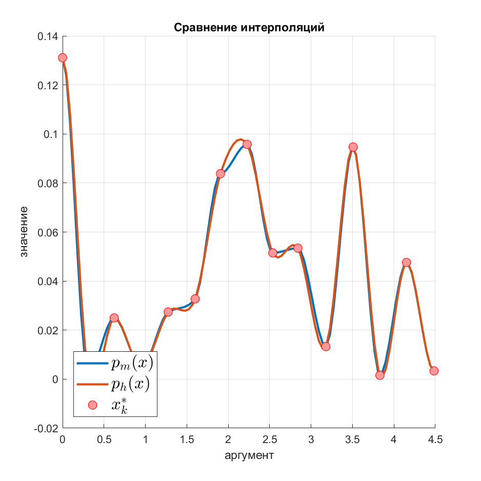

## Монотонная кубическая интерполяция


Монотонная интерполяция кубическими полиномами с помощью алгоритма,
описанного в [статье](https://epubs.siam.org/doi/10.1137/0717021)
Fritsch, F. N.; Carlson, R. E. (1980). "Monotone Piecewise Cubic Interpolation".
SIAM Journal on Numerical Analysis. SIAM. 17 (2): 238–246.




### Структура библиотеки

Исходники программы для сравнивания обычной кубической интерполяции
и монотонной лежат в `src\main\java\Main.java`

Эта программа формирует случайные опорные точки ( `x` и `y` координаты),
после чего создаёт обычный кубический интерполятор и монотонный.

Для каждого интерполятора перебирается заданное количество значений
от первой до последней координат `x` с равным шагом. Для каждого
аргумента вычисляются значение интерполированной функции, а также
первые три её производные: скорость(speed), усорение(acceleration) и рывок(jerk).

Результаты записываются в 4 файла в папке `data\cubic\source`:
- `test-hermit.in` опорные точки траектории при обычной кубической интерполяции
- `test-hermit.out` интерполированные данные при обычной кубической интерполяции
- `test-monotone.in` опорные точки траектории при монотонной кубической интерполяции
- `test-monotone.out` интерполированные данные при монотонной кубической интерполяции

В папке `matlab` лежат скрипты на этом языке для создания графиков
интерполированных данных:
- `f_my_plot.m` - вспомогательная функция для рисования графиков
- `plot_results.m` - непосредственный скрипт, создающий три графика

графики сохраняются в папку `matlab/out`

## Maven

Библиотека собрана в `maven`- зависимость. Пример подключения лежит [здесь](https://github.com/aok-buran/JavaPatternsDemo).

Чтобы подключить её, нужно добавить репозиторий в файл `pom.xml`:

```xml
   <repositories>
        <repository>
            <id>buran-center</id>
            <url>https://mvn.buran.center/releases</url>
        </repository>
    </repositories>
```

Также необходимо подключить саму зависимость:

```xml
    <dependencies>
        <dependency>
            <groupId>center.buran.fast</groupId>
            <artifactId>msplines</artifactId>
            <version>1.0-SNAPSHOT</version>
        </dependency>
    </dependencies>
```